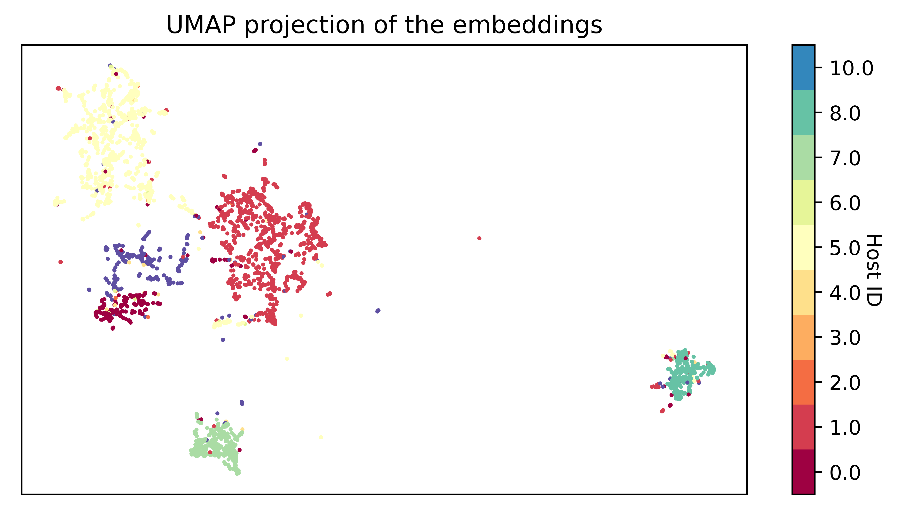

# New Phone, Who This?
**A. de la Bruere, J. Gertsch, S. Layton, M. Mella, W. Stoddard**

## Abstract
We introduce a novel approach to solving speaker diarization -- identifying speakers from natural language -- using our newly developed Conditional Hidden Markov Model (CHMM). Employing this adaptation of the Hidden Markov Model (HMM) and its associated Viterbi algorithm, we accurately identify speakers in written transcriptions from National Public Radio (NPR) broadcasts. After partitioning this training text through unsupervised clustering, our model achieves an accuracy of 77%, competitive with many current deep learning models [Zhang]. In exchange for some accuracy, CHMM provides an easily interpretable model, establishing itself as a viable complement to state-of-the-art deep learning techniques commonly used in this space.

## Problem and Motivation
Speaker diarization is commonly defined as the task of "label[ing] audio or video recordings... to identify 'who spoke when'" [Park]. The speaker can be identified by first transcribing speech data from audio files and then performing analysis on the resulting text. The typical framework consists of breaking up audio into short speech segments called utterances, transcribing the utterances using speech recognition models, and using a variant of a neural network to embed the utterances in a high-dimensional vector space [Park]. Finally, a clustering technique is used on the embedded data to predict who said what.

Speaker diarization tasks are important in many settings. For example, many companies now utilize speaker diarization techniques to provide corporate training for sales representatives and other customer-facing employees. Diarization can distinguish between the customer and employee in audio files of employee-customer interactions, meaning transcripts of these calls can be reliably processed to provide automated feedback. Due to resource constraints on individual training, this feedback may not have been possible otherwise.

As another example, in World War I, French cryptanalysts gained a critical advantage over the German army by learning to distinguish German radio operators by their distinctive "fist," or style of code transmission [Singh]. Similar to analyzing handwriting styles to determine who wrote a document, the French analyzed characteristics such as transmission speed, pauses, and the relative durations of dots and dashes to determine which operator was transmitting code [Singh]. To emphasize the impressiveness of this feat, note that this was humans, not computers, doing speaker diarization, and the French could differentiate between German operators _without decoding their messages_.

Text-based speaker diarization methods, which identify the authors of texts that don't originate from audio, have many important practical applications. For instance, schools and publishers need to detect plagiarism in submitted work. In the corporate world, not detecting employees' use of generative artificial intelligence when prohibited has led to lawsuits in recent years.

However, due to the lack of audio cues such as pitch, tone, and natural speaking style, text-based speaker diarization is more challenging than its audio-based counterpart. While TurnItIn and other entities have achieved modest accuracy in text-based speaker diarization, most methods involve deep learning models, which are computationally expensive.

In contrast, we now present a less computationally expensive model for text-based speaker diarization using HMMs. While the use of HMMs in speaker diarization has been done previously, most research to date has focused on the use of HMMs solely in audio-based speaker diarization [Fox]. By modifying these methods to the task of text-based speaker diarization, our research aims to pave the way for advancements in text-based modeling, analysis, and interpretation.

## Data
Our data consists of 19,000 complete episode transcripts, broken down by utterances (sentences) from NPR programs aired between January 1999 and October 2019. We obtained this data from an NPR podcast dataset made available by Majumder et al. [Majumder]. A few rows of the initial data frame are displayed in Table 1 below. After initially grouping episodes by host, we used only the "Utterance," "Episode," and "Is Host" columns. These three columns represent the text, episode, and labels, respectively.

**Table 1: 5 sample rows of the data frame.**

| Episode | Episode Order | Turn Order | Speaker Order | Host ID | Is Host | Utterance             |
|---------|---------------|------------|---------------|---------|---------|-----------------------|
| 1       | 2             | 0          | 0             | 0       | True    | Good morning.        |
| 1       | 3             | 0          | 1             | -1      | False   | Good morning, Lulu.  |
| 1       | 4             | 0          | 0             | 0       | True    | All right.           |
| 1       | 4             | 1          | 0             | 0       | True    | What's the latest?   |
| 1       | 5             | 0          | 1             | -1      | False   | Well, the latest...  |

To evaluate the reliability of the dataset, we randomly selected a few podcasts and checked several utterances against the actual NPR programs available online. We found no evidence of irregularities.

**Table 2: Cleaned data sample after feature engineering.**

| Episode | Episode Order | Turn Order | Speaker Order | Host ID | Is Host | Utterance           |
|---------|---------------|------------|---------------|---------|---------|---------------------|
| 1       | 2             | 0          | 0             | 0       | True    | good morning        |
| 1       | 3             | 0          | 1             | -1      | False   | good morning lulu   |
| 1       | 4             | 0          | 0             | 0       | True    | all right           |
| 1       | 4             | 1          | 0             | 0       | True    | whats the latest    |
| 1       | 5             | 0          | 1             | -1      | False   | well the latest     |

## Methods

### General Approach

To classify our text, we followed the process of data cleaning, clustering, then CHMM implementation. This approach aims to capture similar speaking styles and content to model the natural evolution of speech from host to guest as a Markov process. We modeled this process under the assumption that podcasts similar in speaking style, vocabulary, and content can be represented by similar Markov models. Hence, we aimed to find a natural clustering of podcasts before applying our main predictive model.

After cleaning the data per the previous section, we categorized each podcast into one of 32 different clusters (since we had 32 hosts). We then trained corresponding models from the data of each cluster. Thus, to make predictions on a new podcast, we determined which cluster it belonged to and applied the cluster's corresponding model.

To find similarities among podcasts, we employed two main clustering strategies and compared their results. The first followed the natural division of podcasts by their 32 different hosts. With this approach, each host had a model trained on a random selection of 80% of their podcasts, with the remaining 20% set aside for testing.

The second clustering method employed a 3-step process involving unsupervised learning. We started this process by implementing a natural language document embedding by using OpenAI's embedding algorithm. This algorithm turns text into vectors with 1536 dimensions, allowing us to compare the similarity of text. We embedded each podcast episode as vectors, then segmented the data with Uniform Manifold Approximation and Projection (UMAP) to reduce the dimensionality to 10 dimensions, decreasing noise and improving separability, as shown in Figure 1.

Finally, we implemented a Gaussian Mixture Model (GMM) on our UMAP-transformed data to perform the clustering. This GMM assumed 8 clusters, a natural division to group our 32 different hosts. When predicting the label for a new podcast, we simply embedded the podcast, transformed it with UMAP, then clustered the result based on our GMM. The corresponding pre-trained Markov model (described below in Training Procedure) was then used to make our prediction.

**Figure 1: A 2-dimensional representation of UMAP transformation on embedded podcasts. The clear separation even in 2-dimensions explains the performance increase when using clustering.**

### Initial Model: HMM

With our podcasts now clustered by similarity, we tackled the task of speaker diarization on individual clusters. Initially, we modeled speaker-to-text assignment with a traditional HMM. The latent variable $$X_{i}$$ contained two states--"host is speaking" or "guest is speaking"--while the observation space $$Z_{i}$$ consisted of words in the English language. Examining the structure of a typical conversation, at each time step (i.e., each word), either Person A speaks again or Person B begins speaking. Both Person A and Person B will use different words with different probabilities. With this framework in mind, an HMM is a natural model to represent (1) the transition of speaking between persons as a hidden state, and (2) the speaking of words (emission) from individual speakers.

However, modeling speaker diarization in this way violates the conditional independence assumption of HMMs. An HMM requires that the observation variable $$Z_{i}$$ is independent of the previous variable $$Z_{i-1}$$ when conditioned on state variable $$X_{i}$$. This assumption is clearly violated as adjacent words $$Z_{i}$$ and $$Z_{i-1}$$ in natural language are not independent.

We illustrate this with the following diagrams, borrowed from the Volume 3 textbook [Jarvis]. In Figure 2, we see how the observed word $$Z_{i}$$ is dependent on both $$X_{i}$$ and $$Z_{i-1}$$. If we wish to model this stochastic process as an HMM, we must ensure such a relationship is conditionally independent as shown in Figure 3.

**Figure 2: $$Z_{i} \not\!\perp\!\!\!\perp Z_{i-1} | X_{i-1}$$**

**Figure 3: $$Z_{i} \perp\!\!\!\perp Z_{i-1} | X_{i-1}, Z_{i-1}$$**

### Adjusted Model: CHMM

To overcome the violated independence assumption, we introduce our original Conditional Hidden Markov Model. The CHMM is described by:

$$\textbf{x}_{i+1} = A_{z_{i-1}} \textbf{x}_i \qquad \textbf{z}_{i} = B_{z_{i-1}} \textbf{x}_i. \qquad$$

Entries of the transition matrix $$A_{z_{i-1}}$$ are $$[a]_{ij} = P(X_i | X_j, Z_{i-1})$$, and entries of the emission matrix $$B_{z_{i-1}}$$ are $$[b]_{ij} = P(Z_i | X_j, Z_{i-1})$$. In a traditional HMM, the probability of $$a_{ij}$$ does not vary with $$Z_{i-1}$$ via the independence assumption of $$P(Z_i | X_j) = P(Z_i | X_j, Z_{i-1})$$. However, with CHMM, $$a_{ij}$$ would vary depending on the previous observation. Thus, we condition on $$Z_{i-1}$$ by introducing a new transition and emission matrix for every possible state in the observation space.

In the context of speaker diarization with a state space of two speakers and observation space of $$d$$ words, the $$2 \times 2$$ transition matrix between speaker states varies depending on its previous word $$Z_{i-1}$$. For example, the transition matrices associated with previous words "welcome" and "really" would vary. The word "welcome" exhibits large off-diagonal entries in the transition matrix $$A_{welcome}$$, indicating a high probability of state change, whereas "really" demonstrates prominent diagonal entries in $$A_{really}$$, reflecting a greater likelihood of state persistence. Thus, we collect all $$d$$ of our conditional transition matrices and construct a transition tensor $$A_k^{ij} = \begin{bmatrix} A_1 & A_2 & \cdots & A_d \end{bmatrix}$$ with a shape of $$(d,2,2)$$. The previous observation word $$Z_{i-1}$$ indexes each transition matrix and follows a similar process for our emission tensor $$B_k^{ij} = \begin{bmatrix} B_1 & B_2 & \cdots & B_d \end{bmatrix}$$ with a shape of $$(d,d,2)$$, as seen in Figure 4.

**Figure 4: A visual comparison between traditional HMM parameters and CHMM tensor parameters indexed by $$Z_{i-1}$$.**

### Training Procedure

In response to this estimation problem, we take advantage of the labeled examples from our training podcasts with all hidden states fully exposed. Hence, rather than fitting parameters with maximum likelihood via Baum-Welch for every new podcast, we can estimate these conditional probabilities directly from our other podcasts in our predefined training clusters.

Our simple training procedure begins by initializing both emission and transition tensors with ones, following a Bayesian framework via Laplace add-one smoothing as presented in Volume 3, Section 4.7.3 [Jarvis]. Repeating for each training cluster, we then count the frequencies of all state transitions, conditioned on the preceding word, and increment the corresponding entries in the transition tensor. Once all text within a cluster has been accounted for, we normalize each individual matrix to be column-stochastic to find the conditional probabilities. We follow the same procedure corresponding to the probabilities found in our emission tensor. We note that the initial state $$\pi_0$$ (a $$2 \times 1$$ vector) is calculated similarly by taking frequencies of the host versus guest speaking first and normalizing.

### Prediction and Model Validity

To make predictions under this new model, we modify the Viterbi algorithm for HMM to find the most probable sequence of hidden states for an entire episode. The Viterbi algorithm uses Bellman's principle to calculate the optimal path, using parameters from both transition and emission matrices at each time step. Our modified Viterbi algorithm follows the same procedure, only now (1) these matrix parameters are no longer temporally homogeneous, and (2) varying sets of parameters will be indexed according to the previous word $$Z_{i-1}$$ in our observation space. All other aspects of the algorithm remain the same, including the back-pointing procedure once the maximum $$\eta_{ij}$$ values have been identified.

The CHMM and modified Viterbi algorithm preserve the assumption of conditional independence. However, there are many alternative ways to model this process. Our methodology entirely ignores punctuation, the length of utterances, and even differences in speaking styles between the host and guest within episodes. Additionally, our model considers speech on a word-by-word basis instead of utterance-by-utterance. Naturally, entire utterances will be spoken by the same individual. Thus, any disagreements within a single utterance predicted by our model present systematic error.

Despite these obvious shortcomings, a word-by-word analysis of just the text alone maintains a very intuitive description of the mechanisms at play. The individual speaking chooses the words being spoken, yet the identity of the speaker is hidden when observing the transcripts alone. According to the natural flow of conversation, the current speaker will produce words for an unspecified number of time steps before switching to another speaker. If the above nuances are correctly conditioned for, this problem is posed as a natural application of HMM. Furthermore, our labeled dataset of podcasts provides a fast, numerically stable alternative to the Baum-Welch algorithm, relying on actual labels instead of maximum likelihood estimates.

## Results and Analysis

Initially, we found that fitting the CHMM to our entire training set gave fairly disappointing results. In particular, the model predicted the speaker of each word in the training set with an average accuracy of 71%. In comparison to the 68% accuracy of the naive prediction, which predicts only one speaker for each episode, this is not much of an improvement. We note that for accuracy scores below 50%, we invert the predictions our model gives and calculate our accuracy as $$1 - accuracy$$. It appeared that assuming hosts will speak in a similar manner to each other is a false assumption as we gained little information training on the entire training set.

Our next approach was to train a CHMM for each unique host. In doing so, we were able to track unique vocabulary choices by each individual host. We found that by training a separate set of parameters for each host, our accuracy improved to roughly 76%.

After accidentally mixing our test and training data and seeing radically improved results of 88% accuracy, we determined that we needed more data than we had for a single host to generate our parameters. We quickly resolved our data leakage problem, and this led us to exploring our different methods of podcast clustering, either by host or embedded similarity.

Clustering episodes into 8 different buckets gave an average of $$2212$$ episodes per cluster. After an 80-20 train-test split, our average train size for CHMM was $$1780$$ episodes. We then trained a separate CHMM for each bucket. We clustered the test data, then used the associated label to identify the corresponding CHMM parameters. Employing this technique only led to a slight increase in accuracy to 77.2%.

**Figure 5: Sample text from a random podcast as CHMM attempts to correctly assign speakers to text.**

Upon closer examination of our predicted labels, we found that each sequence of predicted labels is highly biased toward either the host or the guest, implying that we fail to capture many of the transitions. Figure 6 demonstrates how our rate of false negatives is quite large at 22%.

These results suggest important implications. First, the failure of our CHMM to transition suggested that knowing the preceding word and the speaker who spoke is insufficient information to predict the speaker of the next word. Perhaps an extended state space incorporating more information, such as whether a word is typically a question word, the cumulative length of the utterance, and so forth, could be used to generate better predictions.

**Figure 6: Comparison of the Confusion Matrices which attained 77.2% and 76.4% accuracy respectively.**

| Cluster Confusion Matrix | Host Confusion Matrix |
|--------------------------|-----------------------|
| \(\begin{bmatrix} 0.68894 & 0.01399 \\ 0.22163 & 0.07543 \\ \end{bmatrix}\) | \(\begin{bmatrix} 0.68370 & 0.01582 \\ 0.22284 & 0.07764 \\ \end{bmatrix}\) |

## Ethical Considerations

Since our data comes from NPR, whose hosts and guests consent to the publication of their words to a national audience, there are no privacy concerns with respect to the collection of our data. In addition, since the speaker of each utterance is already widely known, our use of the data does not uncover any new information that might be harmful to the reputation or well-being of any participants.

However, we do note that our methods might be applied in harmful contexts that we have not considered. For example, in many cases, anonymity is key in preserving the safety of those exposing ill treatment or inhumane conditions perpetuated by a government or corporation. As a worst-case scenario, when an individual who would otherwise write anonymous complaints about poor treatment knows that text-based speaker diarization tools might expose them as the author, they may choose not to write or say anything for fear of being caught, perpetuating the unfair treatment.

While we cannot completely control how our methods are used, we can mitigate the possibility of misuse by creating costs and penalties for the malicious use of these methods. In particular, we can advocate for legislation that heavily penalizes companies for using these technologies to punish whistleblowers. We can also encourage world human rights organizations to investigate and publish incidents in which a country uses speaker diarization methods to repressively stifle a complaint.

We also note that putting too much faith in the results of these methods could result in a spurious claim of authorship that would hurt the reputation of the purported author. For example, speaker diarization results might falsely attribute a quote to a certain politician or celebrity. Since people often trust algorithms more than they should, the public would likely trust any false authorship claims backed by these methods. This could lead to an undeserved and unfair defamation of the falsely accused individual.

In an extreme case, false authorship attribution claims could even create a self-fulfilling feedback loop. For instance, if a single racist statement is falsely attributed to Taylor Swift and this result becomes generally accepted, the likelihood of future speaker diarization studies attributing another racist statement to Taylor Swift increases. In this way, incorrect attributions may build upon and reinforce one another without any clear warning signs that something has gone wrong.

While we cannot completely prevent such unfortunate outcomes, we can and do insist that anyone reporting results from speaker diarization methods must emphasize the inherent uncertainty of these methods when presenting their findings. We also insist that any software that purports to perform speaker diarization must both inform the user of the possibility of inaccuracy and stress to the user the responsibility of communicating this to others.

## Conclusion

In conclusion, our results suggest that the CHMM has the potential to be a highly accurate, computationally inexpensive model for text-based speaker diarization problems. We were able to achieve an accuracy of 77.6%, significantly better than random.

However, we cannot conclude from these results alone that our model generalizes well to other speech contexts. Future research should test the applicability of our proposed CHMM in more diverse and complicated texts, such as transcripts of a podcast with many guests or even the script of an argument in a theatrical play.

Future research should also investigate how modifications to our approach may result in greater accuracy. For example, while our methodology predicts the speaker word by word, future research could experiment with a model that classifies based on complete utterances. Specifically, such a model might predict the speaker of each word in an utterance and label the entire utterance with the most commonly predicted speaker. Furthermore, CHMM strictly focuses on text, disregarding parts of speech, punctuation, and even utterance length. We encourage future researchers to explore approaches for integrating these additional elements with CHMM. There is undoubtedly significant identifying information contained in these features, which our model is currently unable to capture.

Nevertheless, the results of this study suggest that the CHMM can aid in solving interesting text-based speaker diarization problems moving forward, such as distinguishing between human authorship and generative artificial intelligence or even identifying authors of historical documents. More work should be done to develop and implement such computationally inexpensive text-based speaker diarization methods. These models are easier to train and simpler to understand, thus providing a valuable counterpart to the deep learning models currently used.

